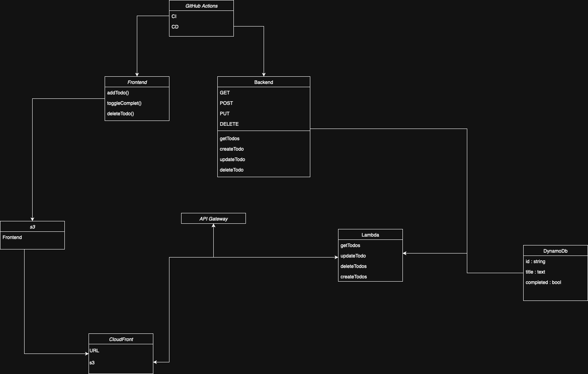

# 🚀 Full-Stack Cloud Todo Application

Modern todo application built with React frontend, Node.js Lambda backend, deployed on AWS with full CI/CD pipeline.

## 🏗️ Architecture



## 📁 Project Structure

```
.
├── client/                 # React frontend
│   ├── src/
│   ├── Dockerfile
│   └── package.json
├── server/                 # Node.js Lambda backend
│   ├── index.mjs
│   └── package.json
├── terraform/              # Infrastructure as Code
│   ├── backend/           # Terraform backend infrastructure
│   │   ├── backend.yaml   # CloudFormation template
│   │   ├── deploy.sh      # Linux/Mac deployment
│   │   ├── deploy.bat     # Windows deployment
│   │   └── deploy.ps1     # PowerShell deployment
│   ├── providers.tf       # Terraform configuration
│   ├── dynamodb.tf        # Database infrastructure
│   ├── lambda.tf          # Serverless functions
│   ├── apigateway.tf      # API infrastructure
│   ├── s3.tf              # Static hosting
│   ├── cloudfront.tf      # CDN configuration
│   ├── ecr.tf             # Container registry
│   └── iam.tf             # Security policies
└── .github/workflows/     # CI/CD pipeline
    └── ci.yml
```

## 🚀 Deployment Guide

### 1. Setup Terraform Backend (One-time setup)

```bash
# Navigate to backend directory
cd terraform/backend

# Deploy backend infrastructure (choose your platform)
./deploy.sh          # Linux/Mac
deploy.bat           # Windows Command Prompt

# The script will automatically update terraform/providers.tf
```

### 2. Configure GitHub Secrets

Add these secrets to your GitHub repository:

- `AWS_ACCESS_KEY_ID`
- `AWS_SECRET_ACCESS_KEY`

### 3. Deploy Application

```bash
# Commit and push changes
git add .
git commit -m "feat: setup infrastructure"
git push origin main

# CI/CD pipeline will automatically:
# ✅ Deploy backend (Lambda + API Gateway + DynamoDB)
# ✅ Build and deploy frontend (React + S3 + CloudFront)
# ✅ Build and push Docker images (ECR)
```

## 🛠️ Local Development

```bash
# Frontend development
cd client
npm install
npm run dev

# Backend testing (optional)
cd server
npm install
# Lambda runs in AWS environment
```

## 🔗 Outputs

After deployment, the CI/CD pipeline will display:

- 📱 **Frontend URL**: CloudFront distribution
- 🔌 **API URL**: API Gateway endpoint
- 🐳 **Docker Registry**: ECR repository

## 🧪 Testing

```bash
# Test the deployed API
curl https://your-api-gateway-url/todos

# Test the frontend
open https://your-cloudfront-url
```

## 📊 Monitoring

- **CloudWatch Logs**: Lambda function logs
- **CloudWatch Metrics**: API Gateway and Lambda metrics
- **X-Ray Tracing**: Request tracing (enabled)

## 🔒 Security Features

- ✅ KMS encryption for Terraform state
- ✅ IAM roles with least privilege principle
- ✅ VPC isolation ready (optional)
- ✅ HTTPS everywhere with CloudFront
- ✅ DynamoDB encryption at rest

## 🏷️ Cost Optimization

- **DynamoDB**: Pay-per-request billing
- **Lambda**: Pay-per-invocation
- **S3**: Optimized storage classes
- **CloudFront**: Global edge caching

## 📝 Environment Variables

The application uses these environment variables:

- `VITE_API_URL`: API Gateway URL (auto-injected during build)
- `TABLE_NAME`: DynamoDB table name (auto-configured)

---

Built with ❤️ using modern AWS serverless architecture
